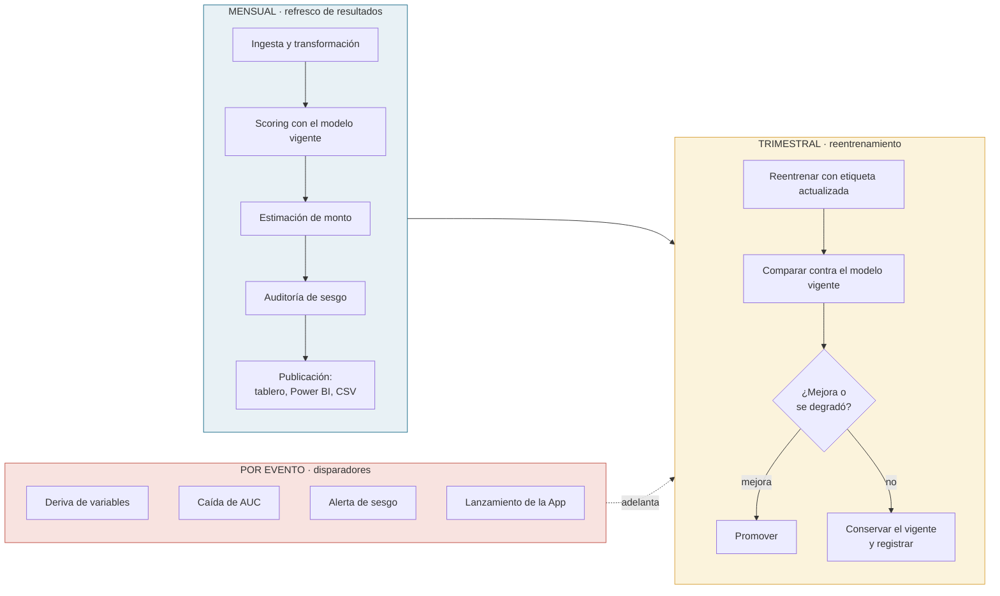
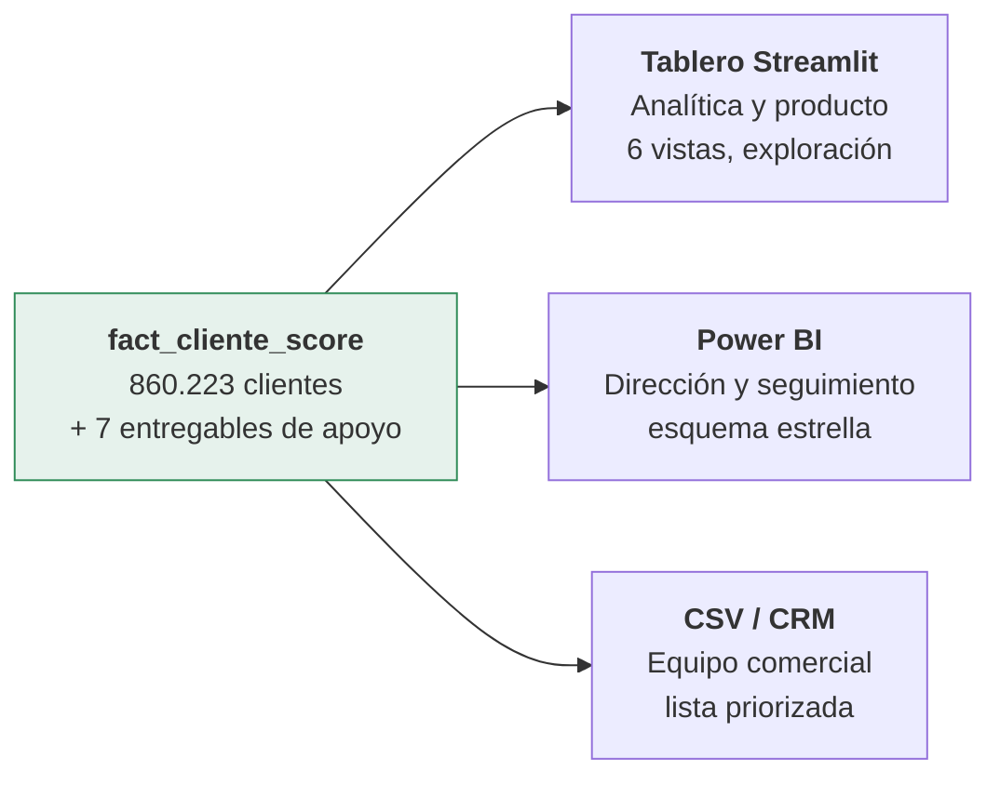
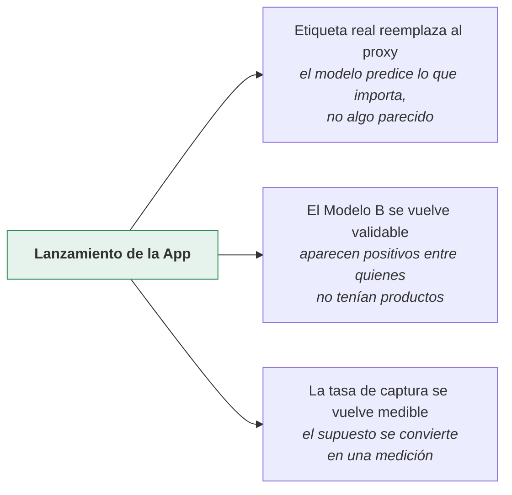

# Esquema de operación

Cómo se generan, actualizan y consumen los resultados analíticos dentro del
ecosistema CREAN, y qué hace falta para su seguimiento, mantenimiento y
evolución como parte de la operación del producto.

Complementa el [modelo conceptual](modelo_conceptual.md), que describe *qué* es
la solución. Este documento describe *cómo vive*.

---

## 1. El ciclo de operación

Tres ritmos distintos, porque no todo cambia a la misma velocidad.

**Por qué mensual y no diario**: el grano útil del dato es el mes. El panel de
saldos se construye a nivel cliente-mes y la ventana de agregación es de seis
meses. Correr esto a diario produciría movimiento sin información nueva y
gastaría cómputo sobre 9,9 millones de filas para nada.

**Por qué trimestral el reentrenamiento**: la etiqueta actual es un proxy que
se mueve lento — un cliente no entra y sale de "tiene saldo en Invesbot" cada
semana. Reentrenar más seguido añadiría varianza, no señal. Esto cambia cuando
la App salga (sección 6).

---

## 2. Generación

Una sola cadena, ejecutable de punta a punta, con orden obligatorio porque hay
dependencias reales entre pasos.

| # | Paso | Produce |
|---|---|---|
| 1 | `scripts/run_pipeline.py` | Bronce, plata, oro y esquema estrella |
| 2 | `notebooks/01_eda.ipynb` | Caracterización y tasas de adopción |
| 3 | `notebooks/03_eda_faltantes.ipynb` | Decisión sobre datos faltantes |
| 4 | `oro/construir_cliente_features.py` | Reconstrucción aplicando el paso 3 |
| 5 | `notebooks/04_validacion_variables.ipynb` | Validación estadística de 64 variables |
| 6 | `notebooks/02_modelado.ipynb` | Modelos A y B, scoring, niveles |
| 7 | `notebooks/06_monto_12m.ipynb` | Monto a 12 meses por componente |
| 8 | `notebooks/07_auditoria_sesgo.ipynb` | Auditoría de sesgo |
| 9 | `notebooks/05_dimensionamiento.ipynb` | Dimensionamiento y resumen ejecutivo |
| 10 | `scripts/export_powerbi.py` | Los 8 entregables de consumo |

Los tiempos por paso no están medidos y por eso no se declaran. Antes de
automatizar el ciclo conviene cronometrar una corrida completa: el volumen
mayor está en la construcción del panel mensual (9,9 millones de filas) y en
el entrenamiento sobre 860 mil clientes, y esos dos definen la ventana de
ejecución.

**El orden no es una recomendación.** El paso 4 vuelve a construir
`cliente_features` porque necesita la decisión que toma el paso 3; saltárselo
deja la tabla con la decisión sin aplicar y nadie se entera. El paso 10 falla
con error explícito si falta cualquier insumo, a propósito: **es preferible que
no haya export a que haya un export parcial silencioso.**

**Responsable**: equipo de analítica. **Automatización sugerida**: orquestador
programado el primer día hábil del mes, con el export como tarea final y
notificación en caso de fallo.

---

## 3. Actualización

Qué se recalcula y qué se conserva en cada ciclo.

| Elemento | Frecuencia | Disparador |
|---|---|---|
| Score de propensión | Mensual | Programado |
| Monto a 12 meses | Mensual | Programado |
| Niveles A/B/C/D | Mensual | Recalculados con el score |
| Auditoría de sesgo | Mensual | Programado |
| **Coeficientes del modelo** | **Trimestral** | Reentrenamiento, o alerta |
| Tasa de captura asumida | Trimestral | **Decisión del negocio**, no del modelo |
| Umbrales de decisión | Cuando se justifique | Cambio documentado en `config.py` |

Un detalle de operación que conviene fijar desde el inicio: **los niveles se
recalculan cada mes**, así que un cliente puede moverse de B a A sin que su
score haya cambiado, simplemente porque la distribución de la población se
movió. Para una campaña en curso hay que congelar la lista del mes, no
reconsultarla. El análisis de sensibilidad ya midió la magnitud de este efecto:
con una definición de etiqueta más exigente, **el 9,7% de los clientes cambia
de nivel**, aunque casi todos se mueven solo un escalón (correlación de rangos
de Spearman = 0,99).

---

## 4. Consumo

Tres canales para tres audiencias. La misma cifra en todos: la fuente única es
`fact_cliente_score`.

| Canal | Audiencia | Qué responde | Cadencia |
|---|---|---|---|
| Tablero Streamlit | Analítica, producto | Todo el detalle: caracterización, sustento del modelo, supuestos | Bajo demanda |
| Power BI | Dirección, seguimiento | Evolución del dimensionamiento y de la base priorizada | Mensual |
| CSV a CRM | Comercial | A quién llamar esta semana | Mensual, congelado por campaña |

**Advertencias que deben viajar con el dato, no aparte:**

- El identificador `numero_id` llega a ±9,2 × 10¹⁸. Cualquier herramienta que lo
  infiera como decimal —Excel, entre otras— le cambia los últimos dígitos en
  silencio. Se exporta **como texto**; en Power BI debe importarse como
  *Whole Number*.
- Los niveles **no son comparables entre poblaciones**: cada A es el cuartil
  superior de la suya.
- El score de la población sin productos es **similitud**, no probabilidad. No
  debe usarse para prometer tasas de conversión.
- La cifra agregada de oportunidad depende de una **tasa de captura asumida**.
  Si se cita sin el supuesto, se está presentando una opinión como si fuera una
  medición.

---

## 5. Seguimiento

Qué se vigila, con qué umbral y quién responde. Sin dueño asignado, un
indicador de monitoreo es decoración.

| Indicador | Umbral de alerta | Frecuencia | Responsable | Acción |
|---|---|---|---|---|
| AUC sobre etiquetas nuevas | Caída > 0,05 respecto a 0,894 | Mensual | Analítica | Adelantar reentrenamiento |
| AUC por encima del techo | > 0,95 | Cada entrenamiento | Analítica | **Detener**: sospecha de fuga |
| Deriva de variables (PSI) | > 0,25 en una variable del top 10 | Mensual | Analítica | Investigar el origen |
| Regla del 80% | Razón < 0,80 | Mensual | Riesgo / Cumplimiento | Documentar antes de operar |
| Proxy de género | AUC > 0,70 | Trimestral | Riesgo / Cumplimiento | Investigar mitigación |
| Error de backtest del monto | Mediana del APE > 10% | Trimestral | Analítica | Recalibrar el recentrado |
| **Tasa de captura real vs asumida** | Desvío > 10 puntos | Mensual tras el lanzamiento | CREAN / Producto | Actualizar `config.TASAS_CAPTURA` |
| Cobertura de la campaña | Conversión real vs precisión esperada | Por campaña | Comercial | Ajustar el percentil de corte |

El indicador de la última fila es el más importante y hoy **no se puede medir**:
la tasa de captura es el supuesto que sostiene toda la cifra de oportunidad y
solo se vuelve observable cuando la App esté en producción. El primer mes con
datos reales convierte el supuesto en una medición, y es la primera corrección
que hay que hacer.

**Registro histórico**: `outputs/decisiones/log_decisiones.csv` es *append-only*
y guarda cada decisión con su evidencia medida. Sirve como bitácora de
auditoría entre corridas — conviene archivarlo con fecha y no dejarlo crecer
indefinidamente en el mismo archivo.

---

## 6. Mantenimiento y evolución

### Lo que protege la solución de degradarse

| Mecanismo | Qué previene |
|---|---|
| Guardián anti-fuga (`src/fuga.py`) | Que una variable derivada de la etiqueta entre al modelo. Corre en cada entrenamiento y **falla ruidosamente** |
| 174 pruebas automáticas | Que un cambio rompa el grano, la agregación o el tablero |
| Reglas de negocio como código (`src/decisiones.py`) | Que una regla viva solo en la cabeza de alguien |
| Umbrales centralizados (`config.py`) | Que cambiar un criterio requiera editar cinco archivos |
| Notebooks versionados con sus salidas | Que no se pueda reconstruir qué produjo una cifra |

El guardián anti-fuga ya demostró su valor: detectó una fuga real que inflaba
el AUC de 0,894 a 0,950. Sin él, la solución se habría entregado con una cifra
falsa y habría fallado en producción sin explicación.

### La evolución no es opcional: la etiqueta caduca

Este es el punto que más condiciona el futuro de la solución.

Hoy la etiqueta de adopción es un **proxy**: "tiene saldo en Invesbot o
Inversión Virtual". Se usa porque la App no existe y no hay adopciones que
observar. **El día que la App salga a producción, ese proxy queda obsoleto** —
habrá un evento de adopción real, con fecha, y será mejor que cualquier
sustituto.

Eso desbloquea tres cosas de golpe:

El segundo punto es el más valioso. Hoy el Modelo B entrega **similitud** para
330.753 clientes porque en esa población no hay ni un solo positivo contra el
cual validar. Cuando alguien sin productos previos adopte la App, ese segmento
empieza a generar etiquetas reales y el modelo pasa de lookalike a
probabilidad. Es el segmento de adquisición en frío, comercialmente el más
interesante y hoy el menos sustentado.

### Hoja de ruta

| Horizonte | Qué se hace | Qué lo habilita |
|---|---|---|
| **Inmediato** | Operar la lista priorizada; abrir un frente de retención con los 40.137 en riesgo | Ya está disponible |
| **Primer trimestre post-lanzamiento** | Sustituir el proxy por la etiqueta real; medir la tasa de captura real | Datos de adopción reales |
| **Segundo trimestre** | Revalidar el Modelo B como probabilidad | Positivos en la población sin productos |
| **Continuo** | Incorporar comportamiento dentro de la App (frecuencia de uso, montos) | Telemetría del producto |
| **Pendiente de decisión** | Modelar la monetización para pasar de volumen a ingreso | Definición de comisiones |

### Deuda técnica reconocida

Estas son limitaciones conocidas, no descubrimientos pendientes. Se declaran
para que quien reciba la solución no las encuentre por sorpresa.

- **Los niveles B y C no diferencian monto.** Dentro de cada uno hay un único
  valor distinto: dispersión exactamente cero. El modelo de monto colapsa a una
  constante en la zona media porque el 90,5% de los clientes tiene crecimiento
  real exactamente cero en productos tipo App. Sirven para priorizar contacto,
  no para dimensionar.
- **El horizonte de 12 meses se extrapola desde ~13 meses de historia**, con
  validación contra 3. Es el dato disponible, pero es poco para una proyección
  anual.
- **La banda estadística agregada no es construible** con una sola ventana
  temporal. Por eso el rango sale de una tasa de captura explícita y no del
  error del modelo.
- **El modelo de monto sobre-predice sistemáticamente** y se corrige recentrando
  por la mediana del error de backtest. Es un parche defendible y medido, pero
  un parche: la causa de fondo es la escasez de historia.
