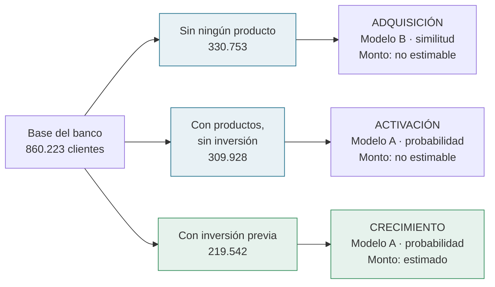
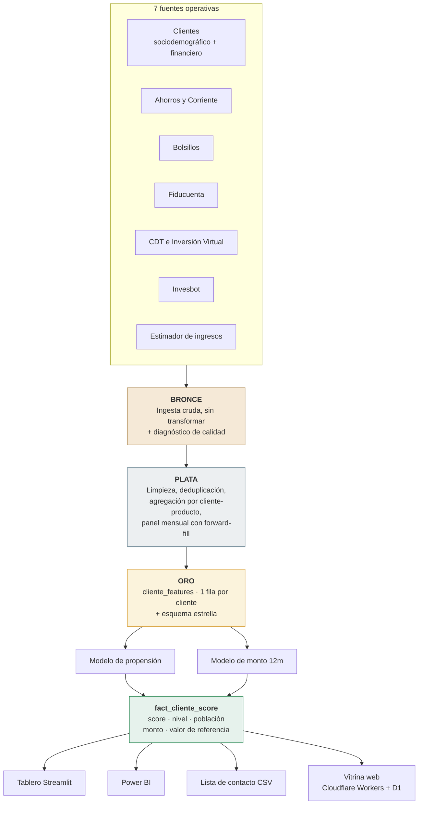
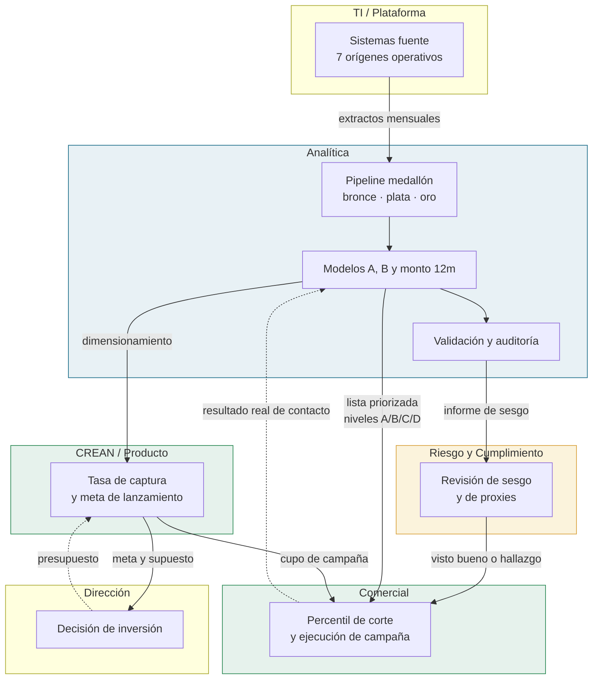
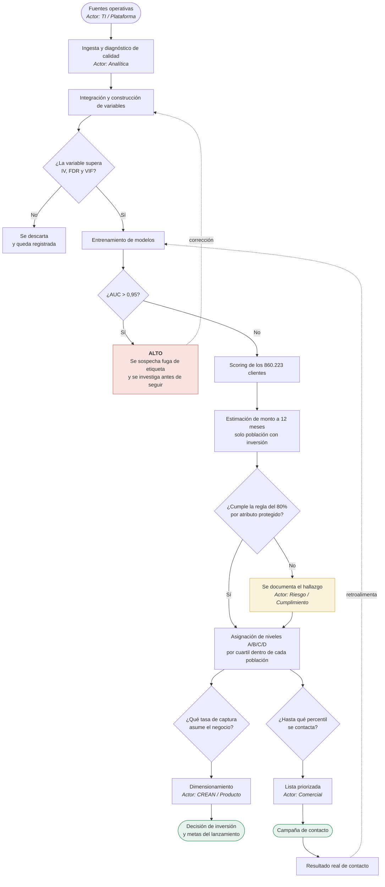
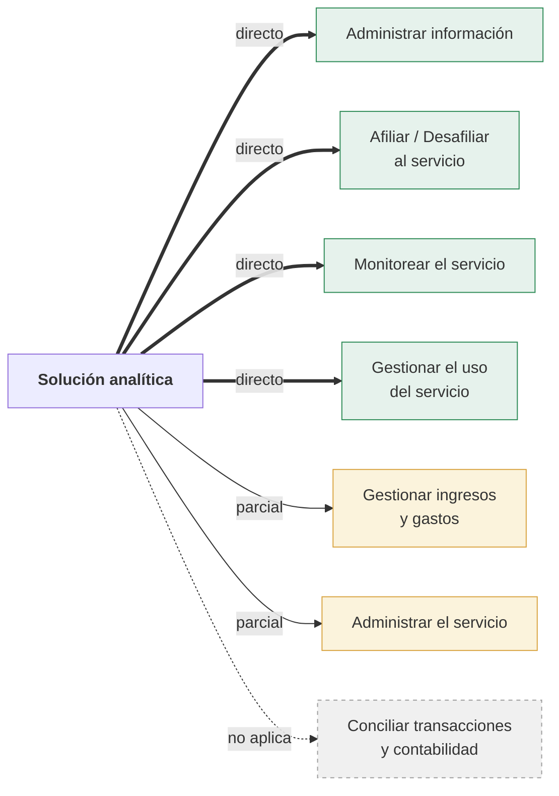

# Modelo conceptual y diagrama de procesos

Cómo la solución analítica aporta a los objetivos del negocio y cómo sus
resultados entran en los procesos de CREAN: flujos de información, actores y
puntos de decisión.

---

## 1. El problema, en términos conceptuales

CREAN necesita responder dos preguntas antes de lanzar la App:

1. **¿Quién adoptaría?** — priorización comercial.
2. **¿Cuánto volumen se canalizaría?** — dimensionamiento de la oportunidad.

La dificultad de fondo es que **la App todavía no existe**, así que no hay
adopciones que observar. La solución construye una **etiqueta proxy**: se
considera "adoptante" a quien hoy tiene saldo activo en **Invesbot** o
**Inversión Virtual**, los dos productos digitales de inversión que más se
parecen a la App. Esa decisión es el supuesto que sostiene todo lo demás, y es
también lo primero que caduca cuando la App salga a producción (ver
[esquema de operación](esquema_operacion.md), sección de evolución).

### Los objetivos de negocio y el aporte de la solución

Antes de describir cómo funciona, conviene fijar contra qué se mide. Cada fila
es un objetivo del negocio, no una capacidad técnica, y la última columna es lo
que hoy está medido — no lo que se espera.

| Objetivo de negocio | Cómo aporta la solución | Evidencia medida |
|---|---|---|
| Lanzar la App con una meta sustentada | Dimensiona el volumen con el supuesto a la vista | 1,86 billones COP de entrada bruta; **186 / 465 / 744** mil M según la tasa de captura que asuma el negocio |
| Concentrar el esfuerzo comercial | Ordena por propensión dentro de cada población | Contactar el **10%** mejor rankeado alcanza al **51,2%** de los adoptantes: 5,1× la tasa base |
| No dejar clientes fuera del análisis | Puntúa al 100% de la base, no solo a quien ya invierte | **860.223** clientes con score, cero nulos |
| Activar a quien ya es cliente | Aísla a quien tiene productos pero ninguno de inversión | **309.928** clientes: uso no realizado, no adquisición |
| Retener saldo que se está yendo | Identifica la salida proyectada, no solo la entrada | **40.137** clientes, −0,76 billones COP |
| Decidir con evidencia, no con opinión | Declara y mide cada supuesto | 64 variables validadas estadísticamente; log de decisiones *append-only* |
| Operar sin riesgo reputacional | Audita el sesgo antes de que la lista se use | Regla del 80% por atributo protegido; proxy de género 0,625 (moderado) |

Dos de estas filas merecen subrayarse porque **no estaban en el encargo** y
salieron del mismo modelo: la población de activación y el bloque de retención.
El encargo pedía a quién ofrecerle la App; el modelo, al proyectar el cambio de
saldo, también señala a quién se está por perder.

De ahí se derivan tres conceptos que estructuran la solución entera:

| Concepto | Qué es | Por qué existe |
|---|---|---|
| **Población** | Partición de la base según qué evidencia hay del cliente | No se le puede pedir lo mismo a un cliente sin productos que a uno que ya invierte |
| **Propensión** | Ordenamiento por probabilidad (o similitud) de adoptar | Responde "a quién" |
| **Monto potencial** | Proyección del cambio de saldo invertido a 12 meses | Responde "cuánto" |

### Las tres poblaciones son tres estrategias

La partición no es una tecnicalidad de modelado: cada población admite una
acción comercial distinta y **solo una de las tres permite estimar monto**.

**Por qué el monto solo se estima en la tercera**: proyectar un saldo requiere
una serie histórica de ese saldo. Quien nunca ha invertido no tiene sobre qué
extrapolar. Para esas dos poblaciones el monto es **nulo, no cero** — es
desconocido, no es ausencia de oportunidad.

**Por qué la primera usa un modelo distinto**: un cliente sin ningún producto
tiene etiqueta de adopción 0 *por construcción* (no puede tener saldo en
Invesbot si no tiene productos). No existen positivos contra los cuales
validar una probabilidad, así que el Modelo B entrega un **puntaje de
similitud** — cuánto se parece a quien sí adoptó — y no una probabilidad.
Es una distinción que hay que sostener frente al negocio: ese número no se
puede presentar como tasa de conversión esperada.

---

## 2. Modelo conceptual de datos

Siete fuentes operativas se integran en una arquitectura medallón hasta
producir una vista única por cliente y un esquema estrella para consumo
analítico.

**Granularidad y trazabilidad**, que es lo que el requerimiento pide garantizar:

| Capa | Grano | Consistencia de identificadores |
|---|---|---|
| Bronce | El de origen (transaccional/diario) | `numero_id` sin tocar; 860.231 filas con 860.223 IDs únicos |
| Plata | Cliente-producto, más panel cliente-mes | Deduplicación explícita; ningún cliente se pierde |
| Oro | **Una fila por cliente** (860.223) | Clave única verificada por test |

Toda variable que entra a un modelo queda registrada en
`outputs/eda/validacion_variables.csv` con su poder predictivo, su
significancia estadística y la decisión de incluirla o descartarla. Toda
decisión de negocio queda en `outputs/decisiones/log_decisiones.csv` con su
motivo y su evidencia medida.

---

## 3. Diagrama de procesos: flujos, actores y decisiones

### 3.1 Quién interviene

Seis actores. La columna que más importa es la tercera: **qué decide cada uno**,
porque delimita dónde termina el modelo y dónde empieza el criterio del negocio.

| Actor | Qué recibe | Qué decide | Qué entrega |
|---|---|---|---|
| **TI / Plataforma** | — | Nada del proceso analítico | Extractos mensuales de las 7 fuentes |
| **Analítica** | Los extractos | Qué variable entra al modelo · si hay fuga · si se reentrena | Score, nivel, monto y auditoría |
| **Riesgo y Cumplimiento** | Informe de sesgo | **Si la lista se puede operar** | Visto bueno, o hallazgo documentado |
| **CREAN / Producto** | Dimensionamiento | **La tasa de captura que se asume** | Meta de lanzamiento |
| **Comercial** | Lista priorizada | Hasta qué percentil se contacta | Resultado real de contacto |
| **Dirección** | Meta y su supuesto | Inversión y alcance del lanzamiento | Presupuesto |

Hay una frontera que conviene no borrar: **el modelo no decide la tasa de
captura ni el percentil de corte**. Entrega el ordenamiento y la curva de
esfuerzo; cuánto se captura y a cuántos se llama son decisiones de negocio con
consecuencias de presupuesto. Presentarlas como salidas del modelo sería
atribuirle una autoridad que no tiene.

### 3.2 Flujos de información entre actores

Las flechas continuas son entregas; las punteadas, retroalimentación. Cada
etiqueta es el artefacto concreto que cambia de manos, no una relación genérica.

El lazo punteado de Comercial hacia los modelos es el que cierra el sistema: sin
el resultado real del contacto, la solución nunca aprende de sí misma y se queda
prediciendo un proxy indefinidamente. Hoy ese lazo **no está conectado** — es
trabajo de integración con el CRM, y está en la hoja de ruta del
[esquema de operación](esquema_operacion.md).

### 3.3 El proceso de punta a punta

Los rombos son **puntos de decisión** con criterio explícito y consecuencia
definida. No son revisiones informales: cada uno tiene un umbral en
`config.py` y una prueba automática que lo verifica.

### 3.4 Los puntos de decisión, uno por uno

| Decisión | Criterio | Si no se cumple | Dónde vive |
|---|---|---|---|
| ¿La variable entra al modelo? | IV ≥ 0,02 · significativa tras corrección Benjamini-Hochberg · VIF < 10 | Se descarta y queda el registro | `src/feature_tests.py` |
| ¿Hay fuga de etiqueta? | AUC ≤ 0,95 | **Se detiene el trabajo** y se investiga | `config.UMBRAL_AUC_FUGA` |
| ¿Hay impacto dispar? | Razón de selección ≥ 0,80 | Se documenta antes de operar la lista | `src/auditoria_sesgo.py` |
| ¿El proxy de género es aceptable? | AUC < 0,60 mínimo · 0,60–0,70 moderado · > 0,70 sustancial | Moderado: se vigila. Sustancial: se investiga mitigación | `config.UMBRAL_AUC_PROXY_*` |
| ¿Qué tasa de captura se asume? | Decisión **del negocio**, no del modelo | — | `config.TASAS_CAPTURA` |
| ¿Cuántos clientes se contactan? | Curva precisión/cobertura según costo del contacto | — | Vista *Modelos* del tablero |

Ese primer control ya se activó en la práctica: el AUC llegó a **0,9497** y la
investigación encontró una fuga real — tres variables de recencia y antigüedad
se calculaban incluyendo los dos productos que definen la etiqueta. Corregidas,
el AUC quedó en **0,8933**, que es la cifra que se reporta.

---

## 4. Aporte a los procesos de CREAN

El requerimiento pide mostrar el aporte a **uno o varios** de los siete
procesos. La solución soporta cuatro de forma directa, dos parcialmente, y
**uno no lo toca en absoluto** — decirlo es más útil que forzar el encaje.

### Aporte directo

**Administrar información** — *gestionar y garantizar el ciclo de vida de la
información derivada de los servicios.*
El pipeline medallón **es** ese ciclo de vida: ingesta trazable, transformación
documentada, diagnóstico de calidad, un grano declarado y verificado por
pruebas en cada capa, y un registro de decisiones con su evidencia. Aporta
además un activo que hoy no existe: **una vista integrada del cliente** a
partir de siete fuentes que viven separadas.

**Afiliar / Desafiliar al servicio** — *gestionar la afiliación o desafiliación
de clientes.*
Es el proceso que la solución alimenta de forma más directa, y por **los dos
lados**:
- *Afiliar*: la lista priorizada de contacto. Contactando al 10% mejor
  rankeado se alcanza al **51,2% de los adoptantes** con precisión del 36,7%,
  **5,1 veces** la tasa base.
- *Desafiliar*: **40.137 clientes** que el modelo proyecta desinvirtiendo,
  −0,76 billones COP. Es una base de retención nominada, con nombre y cédula,
  que sale del mismo modelo y que nadie estaba mirando.

**Monitorear el servicio** — *hacer seguimiento al correcto funcionamiento y
detectar opciones de mejora.*
La solución llega con sus propios controles: umbral de fuga, regla del 80%,
detección de proxy de género, error de backtest y análisis de sensibilidad de
la etiqueta. El detalle de qué se vigila y con qué frecuencia está en el
[esquema de operación](esquema_operacion.md).

**Gestionar el uso del servicio** — *habilitar el correcto funcionamiento del
uso de los servicios.*
Aquí entra la población de **activación**: 309.928 clientes que tienen
productos con el banco pero ninguno de inversión. No son adquisición —ya son
clientes— sino uso no realizado.

### Aporte parcial

**Gestionar ingresos y gastos** — el dimensionamiento es el insumo de entrada
para proyectar ingresos por comisión o por activos administrados, pero la
solución **no modela la monetización**: entrega el volumen potencial, no el
ingreso.

**Administrar el servicio** — la solución define un ANS implícito (la lista
priorizada disponible el primer día hábil de cada mes) pero no gestiona
requerimientos ni novedades.

### No aplica

**Conciliar transacciones y contabilidad** — es integridad contable posterior a
la transacción. La solución es predictiva y previa al hecho: no toca registros
financieros ni los concilia. Forzar un encaje aquí sería inventarlo.

---

## 5. Del modelo a la decisión de negocio

Cierre de la cadena: qué produce cada pieza y qué decisión habilita.

| Pregunta del negocio | Qué la responde | Cifra medida |
|---|---|---|
| ¿A quién le hablamos primero? | Nivel de prioridad por población | 215.057 clientes en nivel A |
| ¿Cuántos contactamos? | Curva precisión/cobertura | Top 10% → 51,2% de cobertura |
| ¿Cuánto podría entrar? | Entrada bruta × tasa de captura | 186 / 465 / 744 mil M COP |
| ¿Es negocio nuevo o traslado? | Descomposición por componente | ≈ mitad viene de CDT y Fiducuenta |
| ¿A quién estamos por perder? | Bloque de riesgo de retiro | 40.137 clientes, −0,76 billones |
| ¿Podemos operar la lista? | Auditoría de sesgo | Proxy de género moderado (0,625) |

**La advertencia que debe acompañar la cifra de oportunidad**: aproximadamente
la mitad del monto proyectado proviene de CDT y Fiducuenta, es decir, de saldo
que **ya está en el banco**. Presentarlo como crecimiento sería contarlo dos
veces a nivel institucional. Es migración de producto, que tiene valor —
mejora la experiencia y la retención— pero no es captación neta.
